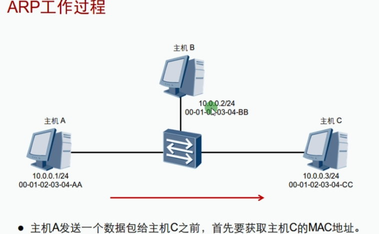
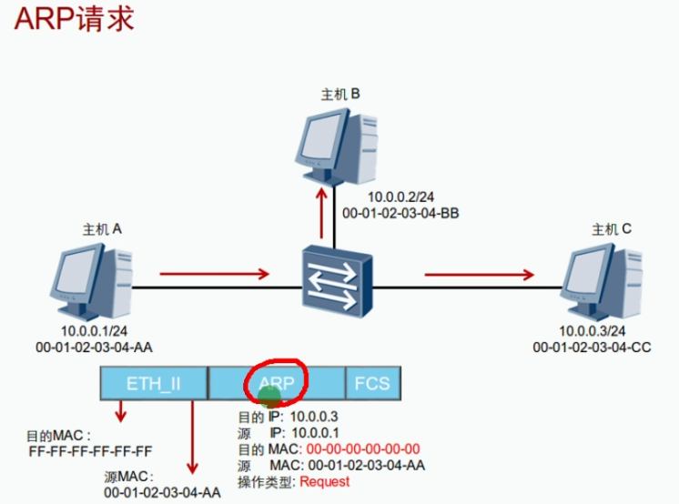
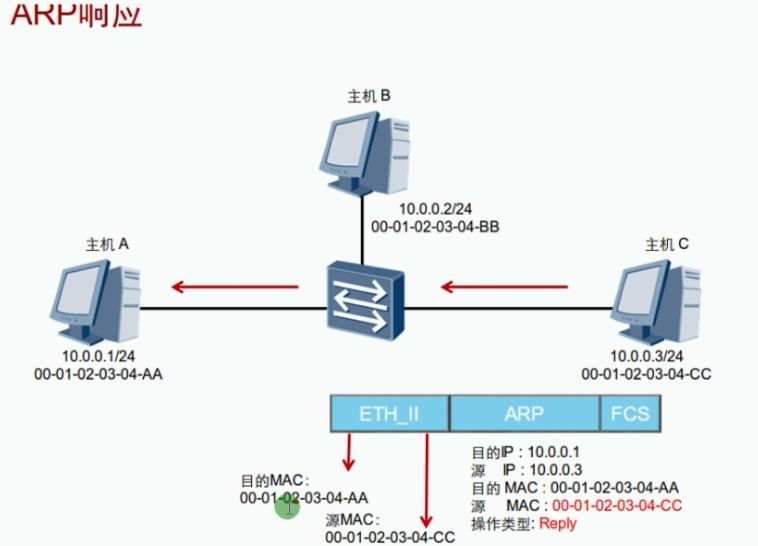
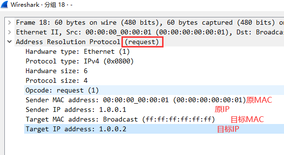
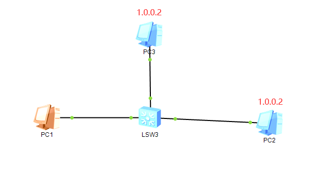

 https://www.bilibili.com/video/BV1Dg4y187bZ?p=12 

# 网络层

## ARP:地址解析协议

### 前言

网络设备有数据要发送给另一台网络设备时，必须知道对方的网络层地址（即IP地址）。IP地址由网络层来提供，但是仅有IP地址是不够的，IP数据报文必须封装成帧才能通过数据链路进行发送。数据帧必须要半酣目的MAC地址，因为发送端还必须获取到目的地的MAC地址。通过目的的IP地址而获取目的MAC地址的过程由ARP协议实现。




## 通讯示例


```bash
//查看arp缓存
arp -a
//清空arp缓存
arp -d
```





### ARP抓包

交换机关闭disable

```bash
stp disable
```

目标MAC	ff:ff:ff:ff:ff:ff	=》广播 	在一个广播域里面的所有人都会收到




### ARP欺骗：攻击者发送"无故ARP响应"来伪装其他设备



```
PC>ping 1.0.0.2

Ping 1.0.0.2: 32 data bytes, Press Ctrl_C to break
From 1.0.0.2: bytes=32 seq=1 ttl=128 time=47 ms
From 1.0.0.2: bytes=32 seq=2 ttl=128 time=31 ms
From 1.0.0.2: bytes=32 seq=3 ttl=128 time=31 ms
From 1.0.0.2: bytes=32 seq=4 ttl=128 time=32 ms
From 1.0.0.2: bytes=32 seq=5 ttl=128 time=47 ms

--- 1.0.0.2 ping statistics ---
  5 packet(s) transmitted
  5 packet(s) received
  0.00% packet loss
  round-trip min/avg/max = 31/37/47 ms

PC>arp -a

Internet Address    Physical Address    Type
1.0.0.2             00-00-00-00-00-03   dynamic

PC>
```

此时	1.0.0.2             00-00-00-00-00-03   dynamic

arp只保存最新的

