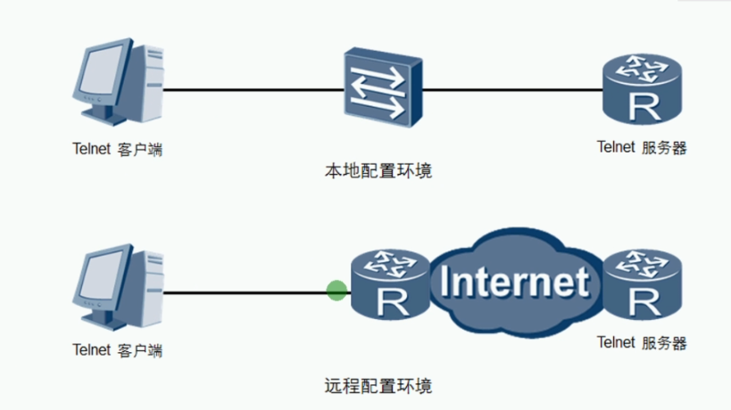

 https://www.bilibili.com/video/BV1Dg4y187bZ?p=25 

# VRP远程管理

|              命令              |          功能          |
| :----------------------------: | :--------------------: |
|        display version         |      显示系统版本      |
|          display user          |  显示已连接的终端用户  |
|          display this          | 显示当前视图的运行配置 |
| dispaly diagnostic-information |  显示设备所有状态信息  |

```bash
<Huawei>dis ver													## 显示系统信息
Huawei Versatile Routing Platform Software
VRP (R) software, Version 5.130 (AR200 V200R003C00)
Copyright (C) 2011-2012 HUAWEI TECH CO., LTD
Huawei AR201 Router uptime is 0 week, 0 day, 3 hours, 50 minutes	## 开机时间

MPU 0(Master) : uptime is 0 week, 0 day, 3 hours, 50 minutes
MPU version information : 
1. PCB      Version  : AR01SRU0A VER.A
2. MAB      Version  : 0
3. Board    Type     : AR201
4. BootROM  Version  : 0

<Huawei>dis users												## 显示链接终端用户
  User-Intf    Delay    Type   Network Address     AuthenStatus    AuthorcmdFlag
+ 0   CON 0   00:00:00                                   pass                   
  Username : Unspecified


<Huawei>sys
Enter system view, return user view with Ctrl+Z.
[Huawei]int lo1
[Huawei-LoopBack1]dis this										##显示当前视图的运行配置
[V200R003C00]
#
interface LoopBack1
 ip address 1.0.0.2 255.255.255.0 
#
return
[Huawei-LoopBack1]
```


## 前言

如果企业网络中有一台或多台网络设备需要远程进行配置和管理，管理员可以使用telnet远程连接到每一台设备上，对这些网络设备进行集中的管理和维护




| 命令                                      | 备注                |
| ----------------------------------------- | ------------------- |
| telnet server enable                      | 开启telnet服务      |
| display telnet server status              | 验证telnet服务      |
| user-interface vty 0 4                    | 进入VTY配置         |
| authentication-mode password/aaa          | 配置认证模式        |
| set authentication password cipher huawei | 配置认证密码        |
| user privilege level 15                   | 配置用户级别        |
| user-interface maximum-vty 15             | 配置最大VTY会话数量 |
| aaa                                       | 进入AAA配置模式     |
| local-user wakin password cipher huawei   | 创建用户和密码      |
| local-user wakin privilege level 15       | 配置用户级别        |
| local-user wakin service type telnet      | 配置用户可用服务    |
|                                           |                     |

```bash
[Huawei]dis ip int br							##查看所有接口的利用率
*down: administratively down
^down: standby
(l): loopback
(s): spoofing
The number of interface that is UP in Physical is 2
The number of interface that is DOWN in Physical is 2
The number of interface that is UP in Protocol is 1
The number of interface that is DOWN in Protocol is 3

Interface                         IP Address/Mask      Physical   Protocol  
GigabitEthernet0/0/0              unassigned           up         down      
GigabitEthernet0/0/1              unassigned           down       down      
GigabitEthernet0/0/2              unassigned           down       down      
NULL0                             unassigned           up         up(s)     

[Huawei]int g0/0/1								## 进入g0/0/0接口
[Huawei-GigabitEthernet0/0/1]ip add 192.168.3.1 24
[Huawei-GigabitEthernet0/0/1]dis ip int br		  ## 查看接口
*down: administratively down
^down: standby
(l): loopback
(s): spoofing
The number of interface that is UP in Physical is 2
The number of interface that is DOWN in Physical is 2
The number of interface that is UP in Protocol is 2
The number of interface that is DOWN in Protocol is 2

Interface                         IP Address/Mask      Physical   Protocol  
GigabitEthernet0/0/0              192.168.108.33/24    down       down      
GigabitEthernet0/0/1              192.168.3.1/24       up         up        
GigabitEthernet0/0/2              unassigned           down       down      
NULL0                             unassigned           up         up(s)     
[Huawei-GigabitEthernet0/0/1]

####################################################################################
### 使用192.168.3.3的电脑ping路由器
PC>ping 192.168.3.1

Ping 192.168.3.1: 32 data bytes, Press Ctrl_C to break
From 192.168.3.1: bytes=32 seq=1 ttl=255 time=31 ms
From 192.168.3.1: bytes=32 seq=2 ttl=255 time=47 ms
From 192.168.3.1: bytes=32 seq=3 ttl=255 time=31 ms
From 192.168.3.1: bytes=32 seq=4 ttl=255 time=31 ms
From 192.168.3.1: bytes=32 seq=5 ttl=255 time=31 ms

--- 192.168.3.1 ping statistics ---
  5 packet(s) transmitted
  5 packet(s) received
  0.00% packet loss
  round-trip min/avg/max = 31/34/47 ms

PC>
####################################################################################


<Huawei>dis tel ser st							## 查看telnet服务
 TELNET IPV4 server                      :Enable
 TELNET IPV6 server                      :Enable
 TELNET server port                      :23

[Huawei]tel server enable 						## 开启telnet服务
 Error: TELNET server has been enabled			 ## 我这边已经开了所以has been enabled
 
##### 密码认证模式
[Huawei]user-in	
[Huawei]user-interface vty 0 4
[Huawei-ui-vty0-4]au	
[Huawei-ui-vty0-4]authentication-mode pa	
[Huawei-ui-vty0-4]authentication-mode password 
Please configure the login password (maximum length 16):123456
[Huawei-ui-vty0-4]us pri level 1				## 用户级别
[Huawei-ui-vty0-4]

[Huawei-ui-vty0-4]d th							## 显示当前视图的配置 display this
[V200R003C00]
#
user-interface con 0
 authentication-mode password
user-interface vty 0 4
 authentication-mode password
 user privilege level 1
 set authentication password cipher %$%$|*x66,~-2A=[5YNMKraM,*,:pUi$1J2KP/2mPO<Y
$fX<*,=,%$%$
user-interface vty 16 20
#
return
[Huawei-ui-vty0-4]

##### aaa模式
[Huawei]aaa										 ## 进入3A模式
[Huawei-aaa]local-user mm password ci			  
[Huawei-aaa]local-user mm password cipher mm123456	## 增加用户
Info: Add a new user.
[Huawei-aaa]local-user mm privilege level 15		## 设置级别
[Huawei-aaa]local-user mm service-type telnet		## 设置可用服务类型(可多选)
[Huawei-aaa]
[Huawei-aaa]dis this							  ##查看当前配置
[V200R003C00]
#
aaa 
 authentication-scheme default
 authorization-scheme default
 accounting-scheme default
 domain default 
 domain default_admin 
 local-user mm password cipher %$%$`puZ*AQ2a,uc/'NO\iG)UXCc%$%$
 local-user mm privilege level 15
 local-user mm service-type telnet
 local-user admin password cipher %$%$K8m.Nt84DZ}e#<0`8bmE3Uw}%$%$
 local-user admin service-type http
#
return
[Huawei-aaa]

```


```bash
## 真机请尽量不用使用这个命令

```

