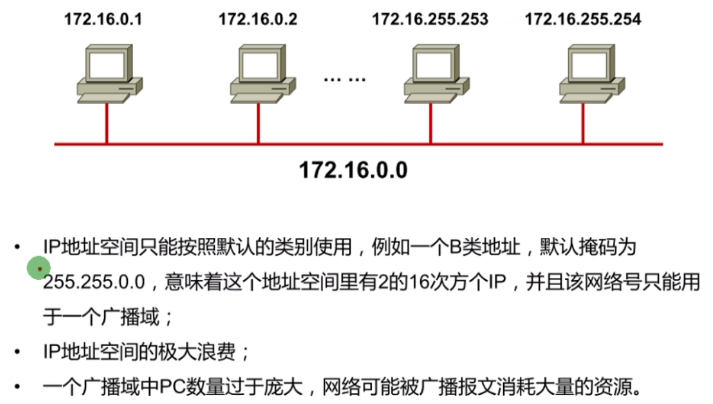
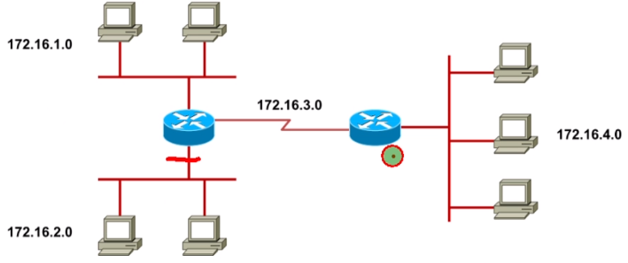

 https://www.bilibili.com/video/BV1Dg4y187bZ?p=20 

# 子网划分

### 有类IP地址规划的缺陷：为什么要子网划分

### 子网划分概述

* 满足不同网络对IP地址的需求
* 实现网络的层次性
* 节省IP地址
* 默认子网掩码可以进一步划分，变成长子网掩码
* 即网络位向主机位的借位

题目：已知一个局域网中由1000台客户端，如果把他放在同一网段中，请问用什么子网掩码比较合适_22__

2^X -2 >1000	x=10	

题目：IP地址为：192.168.1.100/29，则广播地址为____;可用IP数为____;

29-4=5位 划分32个子网，每个子网6台主机

网络地址：

主机地址：

广播地址：

# 子网划分练习

 https://www.bilibili.com/video/BV1G7411V7H7?from=search&seid=10934880137104145601 

主网和子网的区别

主网：172.16.1.1	/16 = 172.16.0.0(主网络号)	掩码：255.255.0.0

子网：172.16.1.1	/24 =  172.16.1.0					掩码：255.255.255.0

什么叫做网络号：主机位全为0的IP地址

什么叫网段：网络号+掩码

什么是广播地址：主机位全为1的IP地址

### 传统方法

172.88.39.70 /27

掩码：11111111.11111111.11111111.11100000 = 255.255.255.224

网络号：**172.88.39**.64

​	70转二进制=01000110 和11100000计算 =》01000000 =》64

​	(01000110取前三位，其他位都是0)

广播地址：**172.88.39**.95

​	主机位：00110  =》 11111   =》01011111 +》95

最后一个可用IP地址：**172.88.39**.94

​	广播好减一

容纳多少台主机：2^5-2 =30 		(5  =>主机位的个数)

### 简便方法

172.88.39.70 /27

网络位：27位	主机位：32-27=5位

容纳多少台主机：2^5-2=30

64	70	96	[ 64=(30+2)*2 ]  [	96=(30+2)*3	]

网络号：**172.88.39**.64

广播地址：**172.88.39**.(96-1=95)

183.79.63.51 /28

网络位：28  主机位：32-28=4

容纳 2^4 = 16

48		51		64

183.79.63.48

183.79.63.63

