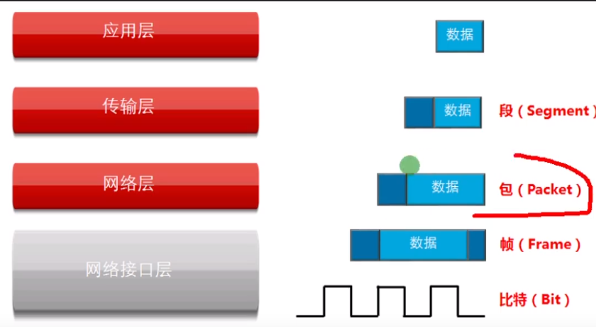

# 网络模型

### 分层思想：将复杂的流程分解为几个功能相对单一的子过程

### 两大模型:   

#### OSI

OSI由ISO(国际标准制定组织)定义

应用层-----------------------------为应用程序提供网络服务

表示层-----------------------------数据格式化。加密解密

会话层-----------------------------建立、维护、管理会话连接

传输层-----------------------------建立、维护、挂历端到端连接

网络层-----------------------------IP寻址和路由选择

数据链路层-----------------------控制网络层与物理层直接的通讯

物理层-----------------------------比特流传输

#### TCP/IP(DoD)

<四层>		<五层>

应用层		应用层

传输层		传输层

网络层		网络层

网络接口层	数据链路层

​			物理层

##### TCP/IP和ISO的对应关系

TCP/IP开发先于OSI，最终在市场上获得认可，目前所以厂商支持并使用

### 数据封装和解封

* 应用数据需要经过每一层处理之后才能通过网络传输到目的端
* OSI把每一层称为PDU
* TCP/IP更具不同层分别使用了段、包、帧、比特
* 逐层向下传递数据，并添加报头和报尾的过程称为封装
* 反之，接收方需要逐层向上传递数据，称为解包

更多网络协议请看->网络模型.assets\network-protocol-map-2020.pdf

 [文件链接](网络模型.assets/network-protocol-map-2020.pdf)

